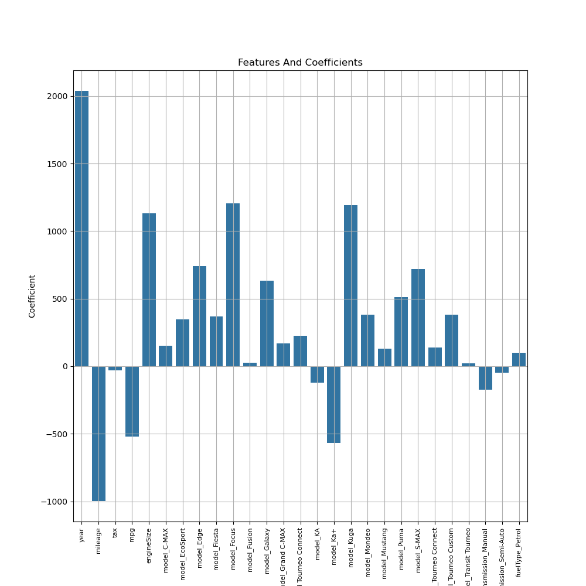
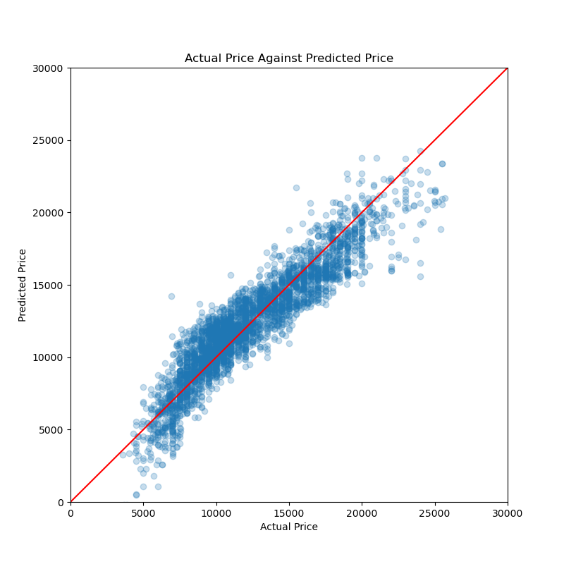
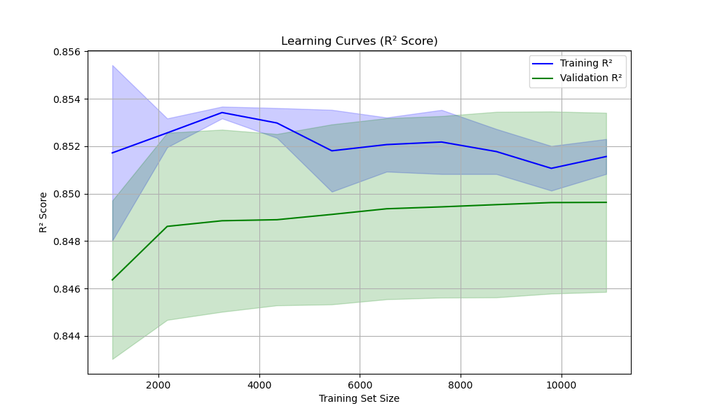

# Ford-Cars-Regression-Model

# Introduction

- This project explores the prices of used Ford car models using Linear Regression. The dataset was cleaned, visualized, and used to build three regression models with 
  different feature subsets. The models were evaluated using various metrics and learning curves.

# Dataset
The dataset include information on various used Ford car models with features such as:
- Model
- Production year
- Price 
- Transmission
- Mileage
- Fuel type
- Tax
- MPG
- Engine size
The dataset was sourced from - https://www.kaggle.com/datasets/adhurimquku/ford-car-price-prediction

# Methodology

# 1. Data Cleaning & Preprocessing

To ensure the quality of the dataset, the following steps were performed:
- Handling Missing/incorrect Values: Imputed/changed or removed missing/incorrect data.
- Outlier Removal: Used 3 standard deviation from the mean to deem which values were outliers
- Feature Engineering: Created dummy variables for categorical features.
- Feature Scaling: Standardized numerical features where necessary.

# 2. Exploratory Data Analysis

Several visualizations were created to understand the data, including:
- How each numerical feature effects price
- Scatterplots for Continuous Features
- Feature Correlations (Heatmaps)
- Boxplots for Categorical Features

# 3. Feature Selection & Model Building

Three Linear Regression models were built, each using a different subset of features:
- Baseline Model: Uses all the features available.
- Removal of high correlated features model: If a feature shared a high correlation with another one was removed.
- RFE Model: Used recursive feature elimination to selected the best features.

# 4. Model Evaluation

Each model was evaluated using the following metrics:
- R-Squared (R^2)
- Mean Absolute Error (MAE)
- Mean Squared Error (MSE)
- Root Mean Squared Error (RMSE)
- Adjusted R-Squared
- Mean Absolute Percentage Error
Additionally, learning curves were generated to analyze model performance and potential overfitting/underfitting.

# Installation
- Clone the repostiory using:
  - git clone https://github.com/AdamBartlett7/Ford-Cars-Regression-Model.git
- Navigate to the correct directory using:
  - cd Ford-Cars-Regression-Model
- To create your own virtual environment with the necessary python libraries use:
   - conda env create -f environment.yml
- Open and run the files.

# Usage

- Run Ford_dataset_cleaning.ipynb to see the initial dataset and how it was cleaned.
- Run Ford_dataset_vis.ipynb to see the data analysis and visualisations.
- Run Ford_dataset_linear_reg.ipynb to see the linear regression models in action.
- All files can be run seperately as the cleaned dataset was saved and then used at the start for the analysis and model.

# Results

# Data Analysis
- From the data analysis and visualisations I found out that Mustangs are the most expensive model on average while Fiestas have the best MPG.
- Also as expected the average price gradually increased with the newer production year. Cars produced in 2010 had and average price of $5000.
  While the most recent cars produced in 2020 had an average price of $19,000. 
- However the same gradual increase was not seen in average MPG. The highest average MPG was in 2015 and 2016 with 61MPG.
  After 2016 the average dropped back down into the 50s.
- Some other findings were seeing the spread of mileage for petrol and diesel cars. Diesel cars had a much larger range and higher 50th and 75th percentile values.
- Also I looked into the spread of price for each type of transmission and found that automatic cars had the higher 25th, 50th and 75th values followed by semi-automatics.

# Linear Regression Models

- Some key insights from the linear regression models were that the features which most postively impacted (increased) the car price 
  were production year and engine size. While the features which negatively impacted (decreased) the price were mileage and mpg.
  All the features and their model coefficients can be seen in this 
- Out of the three models contructed the first model which included all the features performed the best.
- With these scores on the testing set
   - R-squared : 0.855
   - MAE : 1211.641
   - MSE : 2405999.398
   - RMSE : 1551.128
   - Adjusted R-Squared : 0.854
   - Mean Absolute Percentage Error : 10.87%

# Actual VS Predicted

 - This visualisation shows the actual prices for the cars vs the predicted values that the model generated.
 - 

# Learning Curve

- This visualisation shows the learning curve for the first model which performed the best.
- 
 
  

  

License
- This project is licensed under the MIT License. See the LICENSE file for details.

